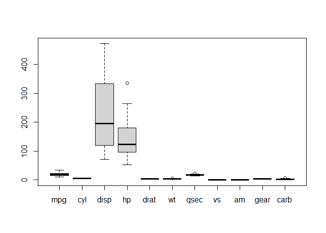
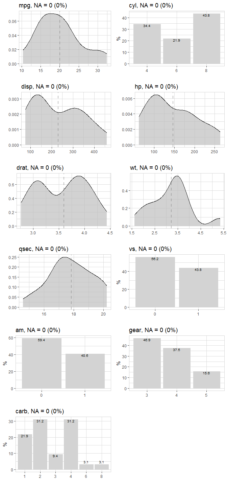
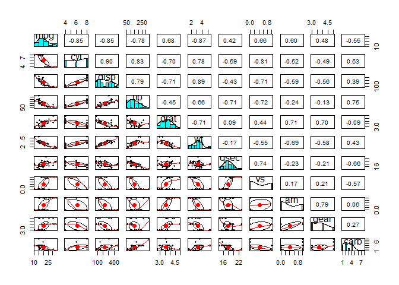
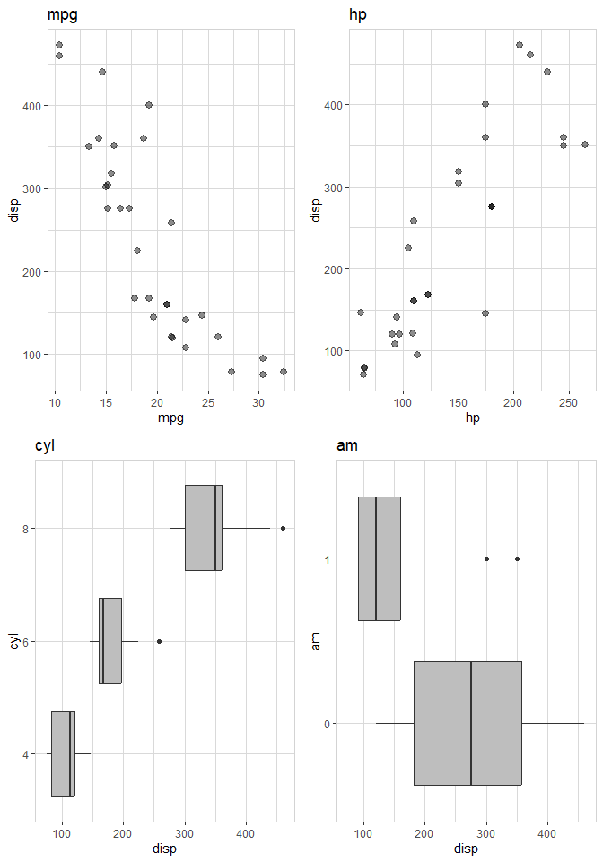
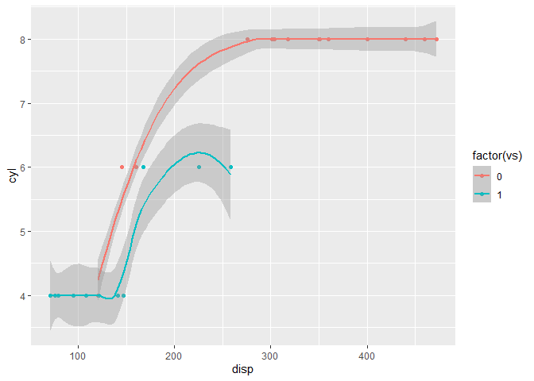
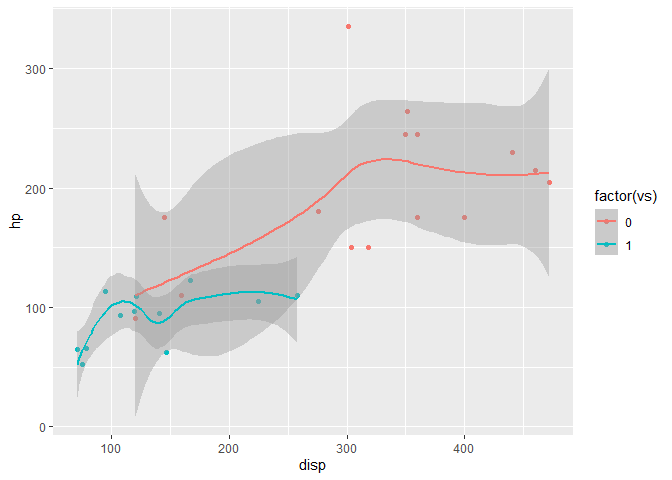
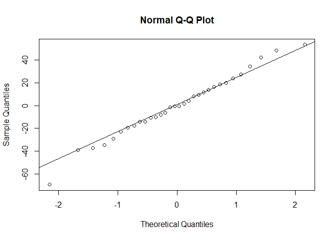
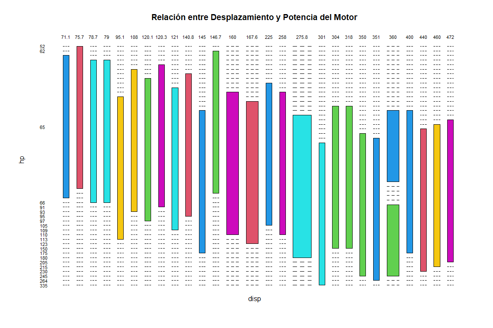
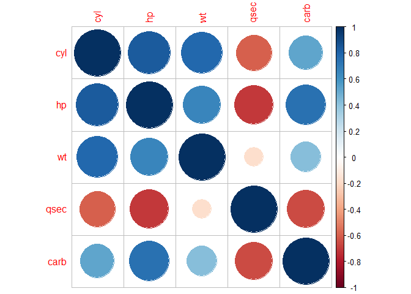

EDA y Regresión lineal
================
Eduardo Vadillo
2024-04-01


En este ejercicio se realizará un análisis exploratorio previo a una
regresión lineal.

## Objetivos del ejercicio

1.  Primer análisis general del dataset.
2.  Realizar regresión lineal.
3.  Utilizar métodos AIC para selección de modelos.
4.  Interpretación de resultados.
5.  Analizar multicolinealidad y Calcular VIF.
6.  Aplicar regularización Ridge y Lasso.

### Carga de datos

Para este ejercicio cargaremos un dataset de prueba integrado en R
llamado mtcars

``` r
df <- mtcars
```

Mostramos las 10 primeras filas para un primer vistazo al dataset

``` r
head(df, n = 10)
```

    ##                    mpg cyl  disp  hp drat    wt  qsec vs am gear carb
    ## Mazda RX4         21.0   6 160.0 110 3.90 2.620 16.46  0  1    4    4
    ## Mazda RX4 Wag     21.0   6 160.0 110 3.90 2.875 17.02  0  1    4    4
    ## Datsun 710        22.8   4 108.0  93 3.85 2.320 18.61  1  1    4    1
    ## Hornet 4 Drive    21.4   6 258.0 110 3.08 3.215 19.44  1  0    3    1
    ## Hornet Sportabout 18.7   8 360.0 175 3.15 3.440 17.02  0  0    3    2
    ## Valiant           18.1   6 225.0 105 2.76 3.460 20.22  1  0    3    1
    ## Duster 360        14.3   8 360.0 245 3.21 3.570 15.84  0  0    3    4
    ## Merc 240D         24.4   4 146.7  62 3.69 3.190 20.00  1  0    4    2
    ## Merc 230          22.8   4 140.8  95 3.92 3.150 22.90  1  0    4    2
    ## Merc 280          19.2   6 167.6 123 3.92 3.440 18.30  1  0    4    4

## 1. Primer análisis general

Comprobamos las variables que tenemos y sus tipos.

``` r
str(df)
```

    ## 'data.frame':    32 obs. of  11 variables:
    ##  $ mpg : num  21 21 22.8 21.4 18.7 18.1 14.3 24.4 22.8 19.2 ...
    ##  $ cyl : num  6 6 4 6 8 6 8 4 4 6 ...
    ##  $ disp: num  160 160 108 258 360 ...
    ##  $ hp  : num  110 110 93 110 175 105 245 62 95 123 ...
    ##  $ drat: num  3.9 3.9 3.85 3.08 3.15 2.76 3.21 3.69 3.92 3.92 ...
    ##  $ wt  : num  2.62 2.88 2.32 3.21 3.44 ...
    ##  $ qsec: num  16.5 17 18.6 19.4 17 ...
    ##  $ vs  : num  0 0 1 1 0 1 0 1 1 1 ...
    ##  $ am  : num  1 1 1 0 0 0 0 0 0 0 ...
    ##  $ gear: num  4 4 4 3 3 3 3 4 4 4 ...
    ##  $ carb: num  4 4 1 1 2 1 4 2 2 4 ...

Contabilizamos los valores vacíos (NA) en el dataset.

``` r
num_nas <- colSums(is.na(df))
num_nas <- sum(!complete.cases(df))
num_nas
```

    ## [1] 0

En este caso no hay ningún valor NA por lo que no será necesario
tratarlos.

También comprobamos los valores mínimos, máximos, medias, medianas y
cuartiles de cada variable.

``` r
summary(df)
```

    ##       mpg             cyl             disp             hp       
    ##  Min.   :10.40   Min.   :4.000   Min.   : 71.1   Min.   : 52.0  
    ##  1st Qu.:15.43   1st Qu.:4.000   1st Qu.:120.8   1st Qu.: 96.5  
    ##  Median :19.20   Median :6.000   Median :196.3   Median :123.0  
    ##  Mean   :20.09   Mean   :6.188   Mean   :230.7   Mean   :146.7  
    ##  3rd Qu.:22.80   3rd Qu.:8.000   3rd Qu.:326.0   3rd Qu.:180.0  
    ##  Max.   :33.90   Max.   :8.000   Max.   :472.0   Max.   :335.0  
    ##       drat             wt             qsec             vs        
    ##  Min.   :2.760   Min.   :1.513   Min.   :14.50   Min.   :0.0000  
    ##  1st Qu.:3.080   1st Qu.:2.581   1st Qu.:16.89   1st Qu.:0.0000  
    ##  Median :3.695   Median :3.325   Median :17.71   Median :0.0000  
    ##  Mean   :3.597   Mean   :3.217   Mean   :17.85   Mean   :0.4375  
    ##  3rd Qu.:3.920   3rd Qu.:3.610   3rd Qu.:18.90   3rd Qu.:1.0000  
    ##  Max.   :4.930   Max.   :5.424   Max.   :22.90   Max.   :1.0000  
    ##        am              gear            carb      
    ##  Min.   :0.0000   Min.   :3.000   Min.   :1.000  
    ##  1st Qu.:0.0000   1st Qu.:3.000   1st Qu.:2.000  
    ##  Median :0.0000   Median :4.000   Median :2.000  
    ##  Mean   :0.4062   Mean   :3.688   Mean   :2.812  
    ##  3rd Qu.:1.0000   3rd Qu.:4.000   3rd Qu.:4.000  
    ##  Max.   :1.0000   Max.   :5.000   Max.   :8.000

Vamos a comprobar los posibles valores atípicos en el dataset.

``` r
boxplot(df, use.cols = T)
```

<!-- -->

Comprobamos que hay un outlier que es en la variable hp (caballos) y en
este caso lo tomamos como válido ya que es posible que un vehículo tenga
muchos más caballos que los demás.

Tras estra primera exploración podemos ver que en principio todo está
correcto por lo que se procede al análisis exploratorio de datos.

#### Exploramos el dataset para ver si hay alguna tendencia en base a la variable disp.

``` r
df %>% explore_all()
```

<!-- -->

En principio no vemos ninguna tendencia clara por lo que haremos un
análisis más profundo comprobando las correlaciones entre las variables.

### Correlaciones

Creamos los paneles para visualizar las posibles correlaciones.

``` r
pairs(df)
```

<!-- -->

``` r
pairs.panels(df)
```

<!-- -->

Tras observar que tenemos alguna correlación alta, vamos a mostrar las
correlaciones entre variables con más de 0.80 para mayor claridad.

``` r
# Calculamos la matriz de correlación
correlation_matrix <- cor(df)

# Obtenemos las posiciones (filas y columnas) de los valores de correlación mayores que 0.80
high_correlation_indices <- which(correlation_matrix > 0.80 & correlation_matrix < 1, arr.ind = TRUE)

# Mostramos las correlaciones mayores que 0.80 junto con las variables a las que pertenecen
for (i in 1:nrow(high_correlation_indices)) {
  row_index <- high_correlation_indices[i, 1]
  col_index <- high_correlation_indices[i, 2]
  correlation <- correlation_matrix[row_index, col_index]
  var1 <- colnames(correlation_matrix)[row_index]
  var2 <- colnames(correlation_matrix)[col_index]
  print(paste("Correlación entre", var1, "y", var2, ":", correlation))
}
```

    ## [1] "Correlación entre disp y cyl : 0.902032872146999"
    ## [1] "Correlación entre hp y cyl : 0.83244745272182"
    ## [1] "Correlación entre cyl y disp : 0.902032872146999"
    ## [1] "Correlación entre wt y disp : 0.887979922058138"
    ## [1] "Correlación entre cyl y hp : 0.83244745272182"
    ## [1] "Correlación entre disp y wt : 0.887979922058138"

Podemos ver que la variable ‘disp’(desplazamiento de los cilindros) está
presente en varias correlaciones incluyendo las de mayor valor por lo
que tomaremos esa variable como referencia.

Vamos a visualizar la variable desplazamiento de los cilindros (disp)
con millas por galón (mpg), caballos (hp), número de cilindros (cyl) y
tipo de transmisión (am)

``` r
df %>% 
  select(disp, mpg, hp, cyl, am) %>% 
  explore_all(target = disp)
```

<!-- -->

Vamos a analizar la relación entre disp y mpg

``` r
ggplot(df, aes(x = disp, y = cyl, color = factor(vs))) + 
  geom_point() + 
  geom_smooth(aes(group = vs))
```

    ## `geom_smooth()` using method = 'loess' and formula = 'y ~ x'

<!-- -->

Comprobamos que cuantos más cilindros tiene el vehículo más
desplazamiento del cilindro obtiene. Esto se refiere a que el motor será
más grande y más potente.

``` r
ggplot(df, aes(x = disp, y = hp, color = factor(vs))) + 
  geom_point() + 
  geom_smooth(aes(group = vs))
```

    ## `geom_smooth()` using method = 'loess' and formula = 'y ~ x'

<!-- -->

Aquí podemos observar que a mayor potencia en caballos mayor
desplazamiento de cilindro obtiene por lo que corroboramos nuestra
teoría anterior.

## 2. Regresión lineal

Ahora vamos a hacer una regresión lineal con la variable disp como
variable independiente.

``` r
rl5 <- lm(formula = disp~., df)
summary(rl5)
```

    ## 
    ## Call:
    ## lm(formula = disp ~ ., data = df)
    ## 
    ## Residuals:
    ##    Min     1Q Median     3Q    Max 
    ## -72.28 -17.11  -0.23  18.95  55.48 
    ## 
    ## Coefficients:
    ##             Estimate Std. Error t value Pr(>|t|)    
    ## (Intercept)   -5.812    228.061  -0.025  0.97991    
    ## mpg            1.940      2.598   0.747  0.46349    
    ## cyl           15.389     12.152   1.266  0.21924    
    ## hp             0.665      0.226   2.942  0.00778 ** 
    ## drat           8.812     19.739   0.446  0.65987    
    ## wt            86.711     16.113   5.382 2.45e-05 ***
    ## qsec         -12.974      8.623  -1.505  0.14730    
    ## vs           -12.115     25.258  -0.480  0.63643    
    ## am            -7.914     25.618  -0.309  0.76044    
    ## gear           5.127     18.058   0.284  0.77927    
    ## carb         -30.107      7.551  -3.987  0.00067 ***
    ## ---
    ## Signif. codes:  0 '***' 0.001 '**' 0.01 '*' 0.05 '.' 0.1 ' ' 1
    ## 
    ## Residual standard error: 31.96 on 21 degrees of freedom
    ## Multiple R-squared:  0.9549, Adjusted R-squared:  0.9335 
    ## F-statistic: 44.51 on 10 and 21 DF,  p-value: 7.255e-12

Creamos un modelo nulo (rl0)

``` r
rl0 <- lm(formula = disp ~ 1, data = df)
```

## 3. Pruebas AIC

Una vez reliazada la regresión lineal, Vamos a hazcer las pruebas AIC y
así veremos con qué modelo nos quedaremos en base a los valores que nos
devuelvan (f-statistic, p-value y adjusted R2)

### Regresión forward

``` r
rl_forward <- step(rl5, 
                   scope = list(lower=rl0, upper=rl5),
                   direction = 'forward')
```

    ## Start:  AIC=230.26
    ## disp ~ mpg + cyl + hp + drat + wt + qsec + vs + am + gear + carb

``` r
summary(rl_forward)
```

    ## 
    ## Call:
    ## lm(formula = disp ~ mpg + cyl + hp + drat + wt + qsec + vs + 
    ##     am + gear + carb, data = df)
    ## 
    ## Residuals:
    ##    Min     1Q Median     3Q    Max 
    ## -72.28 -17.11  -0.23  18.95  55.48 
    ## 
    ## Coefficients:
    ##             Estimate Std. Error t value Pr(>|t|)    
    ## (Intercept)   -5.812    228.061  -0.025  0.97991    
    ## mpg            1.940      2.598   0.747  0.46349    
    ## cyl           15.389     12.152   1.266  0.21924    
    ## hp             0.665      0.226   2.942  0.00778 ** 
    ## drat           8.812     19.739   0.446  0.65987    
    ## wt            86.711     16.113   5.382 2.45e-05 ***
    ## qsec         -12.974      8.623  -1.505  0.14730    
    ## vs           -12.115     25.258  -0.480  0.63643    
    ## am            -7.914     25.618  -0.309  0.76044    
    ## gear           5.127     18.058   0.284  0.77927    
    ## carb         -30.107      7.551  -3.987  0.00067 ***
    ## ---
    ## Signif. codes:  0 '***' 0.001 '**' 0.01 '*' 0.05 '.' 0.1 ' ' 1
    ## 
    ## Residual standard error: 31.96 on 21 degrees of freedom
    ## Multiple R-squared:  0.9549, Adjusted R-squared:  0.9335 
    ## F-statistic: 44.51 on 10 and 21 DF,  p-value: 7.255e-12

### Regresión backward

``` r
rl_backward <- step(rl5, 
                    scope = list(lower=rl0, upper=rl5),
                    direction = 'backward')
```

    ## Start:  AIC=230.26
    ## disp ~ mpg + cyl + hp + drat + wt + qsec + vs + am + gear + carb
    ## 
    ##        Df Sum of Sq   RSS    AIC
    ## - gear  1      82.3 21538 228.38
    ## - am    1      97.5 21553 228.40
    ## - drat  1     203.6 21659 228.56
    ## - vs    1     235.1 21690 228.60
    ## - mpg   1     569.7 22025 229.09
    ## <none>              21455 230.26
    ## - cyl   1    1638.5 23094 230.61
    ## - qsec  1    2313.1 23768 231.53
    ## - hp    1    8845.2 30300 239.30
    ## - carb  1   16240.3 37696 246.29
    ## - wt    1   29588.7 51044 255.99
    ## 
    ## Step:  AIC=228.38
    ## disp ~ mpg + cyl + hp + drat + wt + qsec + vs + am + carb
    ## 
    ##        Df Sum of Sq   RSS    AIC
    ## - am    1      59.0 21597 226.47
    ## - drat  1     223.4 21761 226.71
    ## - vs    1     226.0 21764 226.71
    ## - mpg   1     624.1 22162 227.29
    ## <none>              21538 228.38
    ## - cyl   1    1583.4 23121 228.65
    ## - qsec  1    2464.7 24002 229.84
    ## - hp    1    9396.1 30934 237.96
    ## - carb  1   20458.8 41996 247.75
    ## - wt    1   29666.5 51204 254.09
    ## 
    ## Step:  AIC=226.47
    ## disp ~ mpg + cyl + hp + drat + wt + qsec + vs + carb
    ## 
    ##        Df Sum of Sq   RSS    AIC
    ## - vs    1     189.1 21786 224.75
    ## - drat  1     195.8 21792 224.75
    ## - mpg   1     565.2 22162 225.29
    ## <none>              21597 226.47
    ## - cyl   1    2212.9 23809 227.59
    ## - qsec  1    2532.1 24129 228.01
    ## - hp    1    9359.2 30956 235.99
    ## - carb  1   21423.2 43020 246.52
    ## - wt    1   30150.7 51747 252.43
    ## 
    ## Step:  AIC=224.74
    ## disp ~ mpg + cyl + hp + drat + wt + qsec + carb
    ## 
    ##        Df Sum of Sq   RSS    AIC
    ## - drat  1       200 21986 223.04
    ## - mpg   1       594 22380 223.61
    ## <none>              21786 224.75
    ## - cyl   1      3077 24863 226.97
    ## - qsec  1      4538 26324 228.80
    ## - hp    1      9286 31072 234.11
    ## - carb  1     21275 43061 244.55
    ## - wt    1     32736 54521 252.10
    ## 
    ## Step:  AIC=223.04
    ## disp ~ mpg + cyl + hp + wt + qsec + carb
    ## 
    ##        Df Sum of Sq   RSS    AIC
    ## - mpg   1       753 22738 222.11
    ## <none>              21986 223.04
    ## - cyl   1      2979 24964 225.10
    ## - qsec  1      5163 27149 227.79
    ## - hp    1      9332 31318 232.36
    ## - carb  1     22066 44052 243.28
    ## - wt    1     32537 54522 250.10
    ## 
    ## Step:  AIC=222.11
    ## disp ~ cyl + hp + wt + qsec + carb
    ## 
    ##        Df Sum of Sq   RSS    AIC
    ## <none>              22738 222.11
    ## - cyl   1      2418 25157 223.35
    ## - qsec  1      4993 27732 226.47
    ## - hp    1      8850 31588 230.63
    ## - carb  1     23020 45758 242.49
    ## - wt    1     37909 60648 251.51

``` r
summary(rl_backward)
```

    ## 
    ## Call:
    ## lm(formula = disp ~ cyl + hp + wt + qsec + carb, data = df)
    ## 
    ## Residuals:
    ##    Min     1Q Median     3Q    Max 
    ## -69.38 -15.09  -0.55  17.11  53.52 
    ## 
    ## Coefficients:
    ##             Estimate Std. Error t value Pr(>|t|)    
    ## (Intercept) 141.6961   125.6707   1.128  0.26982    
    ## cyl          13.1396     7.9019   1.663  0.10835    
    ## hp            0.6255     0.1966   3.181  0.00378 ** 
    ## wt           80.4508    12.2194   6.584 5.56e-07 ***
    ## qsec        -14.6784     6.1429  -2.389  0.02441 *  
    ## carb        -28.7548     5.6047  -5.130 2.38e-05 ***
    ## ---
    ## Signif. codes:  0 '***' 0.001 '**' 0.01 '*' 0.05 '.' 0.1 ' ' 1
    ## 
    ## Residual standard error: 29.57 on 26 degrees of freedom
    ## Multiple R-squared:  0.9522, Adjusted R-squared:  0.9431 
    ## F-statistic: 103.7 on 5 and 26 DF,  p-value: 2.536e-16

### Regresión stepwise

``` r
rl_stepwise <- step(rl5, 
                    scope = list(lower=rl0, upper=rl5),
                    direction = 'both')
```

    ## Start:  AIC=230.26
    ## disp ~ mpg + cyl + hp + drat + wt + qsec + vs + am + gear + carb
    ## 
    ##        Df Sum of Sq   RSS    AIC
    ## - gear  1      82.3 21538 228.38
    ## - am    1      97.5 21553 228.40
    ## - drat  1     203.6 21659 228.56
    ## - vs    1     235.1 21690 228.60
    ## - mpg   1     569.7 22025 229.09
    ## <none>              21455 230.26
    ## - cyl   1    1638.5 23094 230.61
    ## - qsec  1    2313.1 23768 231.53
    ## - hp    1    8845.2 30300 239.30
    ## - carb  1   16240.3 37696 246.29
    ## - wt    1   29588.7 51044 255.99
    ## 
    ## Step:  AIC=228.38
    ## disp ~ mpg + cyl + hp + drat + wt + qsec + vs + am + carb
    ## 
    ##        Df Sum of Sq   RSS    AIC
    ## - am    1      59.0 21597 226.47
    ## - drat  1     223.4 21761 226.71
    ## - vs    1     226.0 21764 226.71
    ## - mpg   1     624.1 22162 227.29
    ## <none>              21538 228.38
    ## - cyl   1    1583.4 23121 228.65
    ## - qsec  1    2464.7 24002 229.84
    ## + gear  1      82.3 21455 230.26
    ## - hp    1    9396.1 30934 237.96
    ## - carb  1   20458.8 41996 247.75
    ## - wt    1   29666.5 51204 254.09
    ## 
    ## Step:  AIC=226.47
    ## disp ~ mpg + cyl + hp + drat + wt + qsec + vs + carb
    ## 
    ##        Df Sum of Sq   RSS    AIC
    ## - vs    1     189.1 21786 224.75
    ## - drat  1     195.8 21792 224.75
    ## - mpg   1     565.2 22162 225.29
    ## <none>              21597 226.47
    ## - cyl   1    2212.9 23809 227.59
    ## - qsec  1    2532.1 24129 228.01
    ## + am    1      59.0 21538 228.38
    ## + gear  1      43.8 21553 228.40
    ## - hp    1    9359.2 30956 235.99
    ## - carb  1   21423.2 43020 246.52
    ## - wt    1   30150.7 51747 252.43
    ## 
    ## Step:  AIC=224.74
    ## disp ~ mpg + cyl + hp + drat + wt + qsec + carb
    ## 
    ##        Df Sum of Sq   RSS    AIC
    ## - drat  1       200 21986 223.04
    ## - mpg   1       594 22380 223.61
    ## <none>              21786 224.75
    ## + vs    1       189 21597 226.47
    ## + gear  1        48 21737 226.67
    ## + am    1        22 21764 226.71
    ## - cyl   1      3077 24863 226.97
    ## - qsec  1      4538 26324 228.80
    ## - hp    1      9286 31072 234.11
    ## - carb  1     21275 43061 244.55
    ## - wt    1     32736 54521 252.10
    ## 
    ## Step:  AIC=223.04
    ## disp ~ mpg + cyl + hp + wt + qsec + carb
    ## 
    ##        Df Sum of Sq   RSS    AIC
    ## - mpg   1       753 22738 222.11
    ## <none>              21986 223.04
    ## + drat  1       200 21786 224.75
    ## + vs    1       193 21792 224.75
    ## + gear  1        71 21915 224.93
    ## + am    1         7 21979 225.03
    ## - cyl   1      2979 24964 225.10
    ## - qsec  1      5163 27149 227.79
    ## - hp    1      9332 31318 232.36
    ## - carb  1     22066 44052 243.28
    ## - wt    1     32537 54522 250.10
    ## 
    ## Step:  AIC=222.11
    ## disp ~ cyl + hp + wt + qsec + carb
    ## 
    ##        Df Sum of Sq   RSS    AIC
    ## <none>              22738 222.11
    ## + mpg   1       753 21986 223.04
    ## - cyl   1      2418 25157 223.35
    ## + drat  1       358 22380 223.61
    ## + vs    1       229 22510 223.79
    ## + gear  1       197 22542 223.84
    ## + am    1        39 22699 224.06
    ## - qsec  1      4993 27732 226.47
    ## - hp    1      8850 31588 230.63
    ## - carb  1     23020 45758 242.49
    ## - wt    1     37909 60648 251.51

``` r
summary(rl_stepwise)
```

    ## 
    ## Call:
    ## lm(formula = disp ~ cyl + hp + wt + qsec + carb, data = df)
    ## 
    ## Residuals:
    ##    Min     1Q Median     3Q    Max 
    ## -69.38 -15.09  -0.55  17.11  53.52 
    ## 
    ## Coefficients:
    ##             Estimate Std. Error t value Pr(>|t|)    
    ## (Intercept) 141.6961   125.6707   1.128  0.26982    
    ## cyl          13.1396     7.9019   1.663  0.10835    
    ## hp            0.6255     0.1966   3.181  0.00378 ** 
    ## wt           80.4508    12.2194   6.584 5.56e-07 ***
    ## qsec        -14.6784     6.1429  -2.389  0.02441 *  
    ## carb        -28.7548     5.6047  -5.130 2.38e-05 ***
    ## ---
    ## Signif. codes:  0 '***' 0.001 '**' 0.01 '*' 0.05 '.' 0.1 ' ' 1
    ## 
    ## Residual standard error: 29.57 on 26 degrees of freedom
    ## Multiple R-squared:  0.9522, Adjusted R-squared:  0.9431 
    ## F-statistic: 103.7 on 5 and 26 DF,  p-value: 2.536e-16

Nos quedamos con el modelo de la prueba aic stepwise ya que los valores
que recibimos son muy buenos: - Adjusted R2 -\> 0.94 - F-Statistic -\>
0.95 - p-value -\> 2.536e-16

Además obtenemos excelentes signif. codes.

Ahora vamos a comprobar la normalidad de los residuos del modelo

``` r
qqnorm(rl_stepwise$residuals)
qqline(rl_stepwise$residuals)
```

<!-- -->

Podemos comprobar que los residuos siguen una desviación normal.

Vamos a aplicar el test de Shapiro para los residuos

``` r
shapiro.test(rl5$residuals)
```

    ## 
    ##  Shapiro-Wilk normality test
    ## 
    ## data:  rl5$residuals
    ## W = 0.98368, p-value = 0.8967

## 4. Interpretación de resultados

Con los resultados obtenidos en el test de Shapiro y dado que el W es
cercano a 1 y el p-value es mayor que 0.05 no hay suficiente evidencia
para rechazar la hipótesis nula de normalidad de los residuos del
modelo. En otras palabras, los datos podrían ser consistentes con una
distribución normal.

### Vamos a crear un mosaic plot

``` r
mosaicplot(~ disp + hp,
            data = df, 
            color = 2:7,
            las = 1,
            main = "Relación entre Desplazamiento y Potencia del Motor")
```

<!-- -->

En este gráfico podemos observar que cuanto más potencia tiene el
vehículo más desplazamiento tienden a tener aunque puede haber
excepciones.

## 5. Multicolinealidad y VIF

. Vamos a comprobar si hay multicolinealidad entre las variables de
nuestro modelo y nos ayudaremos con el factor de inflación de la
varianza (VIF) Para ello primero obtendremos las variables
independientes del modelo de regresión rl_stepwise

``` r
X <- rl_stepwise$model[, c("cyl", "hp", "wt", "qsec", "carb")]
```

``` r
correlation_matrix <- cor(X)
corrplot(correlation_matrix, method = "circle")
```

<!-- -->

``` r
vif_results <- vif(rl_stepwise)
vif_results
```

    ##      cyl       hp       wt     qsec     carb 
    ## 7.059328 6.443273 5.067103 4.271186 2.904933

Comprobamos que aunque tiene algún valor un poco alto no es
significativamente indicador de multicolinealidad entre nuestras
variables ya que no tenemos un VIF alto (eneralmente mayor que 10).

## 6. Ridge y Lasso

Ejecutamos el modelo ridge y lo comprobamos. Primero definimos las
variables independientes del modelo rl_stepwise a partir de los datos
originales

``` r
X <- as.matrix(df[, -ncol(df)])
y <- df[, ncol(df)]
```

### Ridge

``` r
modelo_ridge <- cv.glmnet(x = as.matrix(X), y = y, alpha = 0)

print(modelo_ridge)
```

    ## 
    ## Call:  cv.glmnet(x = as.matrix(X), y = y, alpha = 0) 
    ## 
    ## Measure: Mean-Squared Error 
    ## 
    ##     Lambda Index Measure     SE Nonzero
    ## min 0.1192   100  0.9322 0.2225      10
    ## 1se 1.3390    74  1.1383 0.3537      10

Estos resultados muestran que el modelo ridge ajustado con validación
cruzada tiene un valor óptimo de lambda de 0.1192, con un MSE de 0.9351
y 10 predictores no nulos. Además, el valor de lambda correspondiente a
1 error estándar de la solución óptima es 1.6129, con un MSE ligeramente
más alto de 1.2180 y también 10 predictores no nulos.

### Lasso

``` r
# Ajustar el modelo de regresión LASSO con validación cruzada
modelo_lasso <- cv.glmnet(x = as.matrix(X), y = y, alpha = 1)

# Imprimir el modelo
print(modelo_lasso)
```

    ## 
    ## Call:  cv.glmnet(x = as.matrix(X), y = y, alpha = 1) 
    ## 
    ## Measure: Mean-Squared Error 
    ## 
    ##      Lambda Index Measure     SE Nonzero
    ## min 0.00409    62  0.8339 0.2907      10
    ## 1se 0.05041    35  1.1159 0.3869       8

Estos resultados muestran que el modelo Lasso ajustado con validación
cruzada tiene un valor óptimo de lambda de 0.00339 en el caso mínimo y
0.04185 en el caso 1SE. Para el caso mínimo de lambda, el MSE es 0.8619
con 10 predictores no nulos, mientras que para el caso 1SE, el MSE es
ligeramente más alto en 1.0615 con 9 predictores no nulos.
